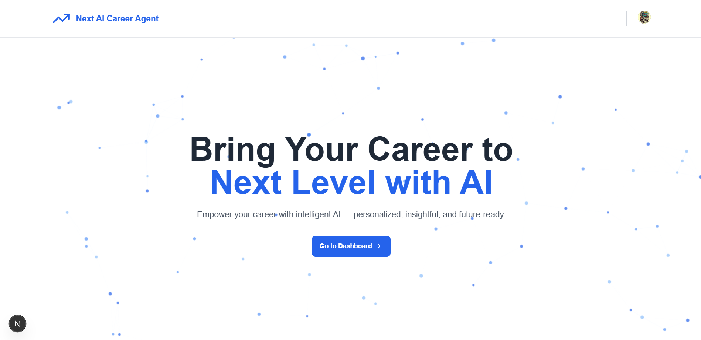

# Next AI Career Agent



## Revolutionize Your Career Journey with AI

Next AI Career Agent is a cutting-edge platform that leverages artificial intelligence to provide personalized career guidance, skill development roadmaps, resume analysis, and more. Whether you're starting your career, looking to switch paths, or aiming for advancement, our suite of AI-powered tools will help you navigate your professional journey with confidence.

## 🚀 Features

### 🤖 AI Career Q&A Chat

Get instant answers to all your career-related questions. Our AI career coach provides professional guidance on job searching, interview preparation, skill development, career transitions, and industry trends.

### 📝 AI Resume Analyzer

Upload your resume and receive a comprehensive analysis with actionable feedback. Our AI evaluates your resume's strengths and weaknesses, providing section-by-section scoring and specific recommendations for improvement.

### 🗺️ Career Roadmap Generator

Input your desired position or skills, and our AI will create a personalized learning roadmap. Visualize your career development path with a clear, step-by-step guide showing what to learn and in what order.

### ✉️ Cover Letter Generator

Create tailored cover letters that highlight your relevant skills and experiences for specific job applications.

## 💻 Tech Stack

- **Frontend**: Next.js, React, Tailwind CSS
- **Authentication**: Clerk
- **Database**: PostgreSQL (via Neon DB)
- **AI Integration**: Gemini AI
- **File Storage**: ImageKit
- **Background Processing**: Inngest
- **Styling**: Tailwind CSS with custom components

## 🛠️ Getting Started

### Prerequisites

- Node.js (v18 or higher)
- npm or yarn
- PostgreSQL database (or Neon DB account)
- Clerk account for authentication
- Gemini API key
- ImageKit account

### Installation

1. Clone the repository

```bash
git clone https://github.com/yourusername/next-aicareeragent.git
cd next-aicareeragent
```

2. Install dependencies

```bash
npm install
# or
yarn install
```

3. Set up environment variables

   - Copy `.env.example` to `.env.local`
   - Fill in the required environment variables

4. Run the development server

```bash
npm run dev
# or
yarn dev
```

5. Open [http://localhost:3000](http://localhost:3000) in your browser

## 📊 Project Structure

```
├── app/                  # Next.js app directory
│   ├── (auth)/           # Authentication routes
│   ├── (routes)/         # Main application routes
│   │   ├── ai-tools/     # AI tools implementation
│   │   ├── dashboard/    # Dashboard components
│   │   └── my-history/   # User history components
│   ├── api/              # API routes
│   └── _components/      # Shared components
├── components/           # UI components
├── configs/              # Configuration files
├── context/              # React context providers
├── inngest/              # Inngest functions
└── public/               # Static assets
```

## 🔒 Authentication

The application uses Clerk for authentication, providing secure user management with features like:

- Email/password authentication
- Social login options
- User profile management

## 🌐 API Integration

The application integrates with several APIs:

- **Gemini AI**: Powers the AI chat, resume analysis, and roadmap generation
- **ImageKit**: Handles file storage for uploaded resumes
- **Inngest**: Manages background processing for AI tasks

## 📱 Responsive Design

The application is fully responsive and works seamlessly across desktop, tablet, and mobile devices.

## 🔄 Continuous Development

This project is under active development. Future enhancements include:

- Additional AI tools for career development
- Enhanced analytics and insights
- Integration with job boards and application tracking
- Community features for peer support

## 🙏 Acknowledgements

- [Next.js](https://nextjs.org/)
- [React](https://reactjs.org/)
- [Tailwind CSS](https://tailwindcss.com/)
- [Clerk](https://clerk.dev/)
- [Gemini AI](https://gemini.google.com/)
- [Inngest](https://www.inngest.com/)
- [ImageKit](https://imagekit.io/)

---

@ 2025 Next AI Career Agent. All rights reserved.
